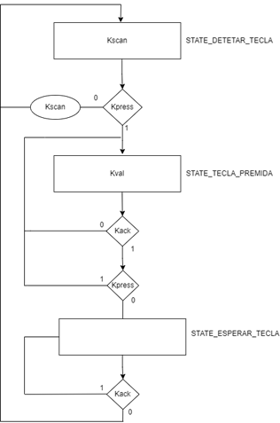
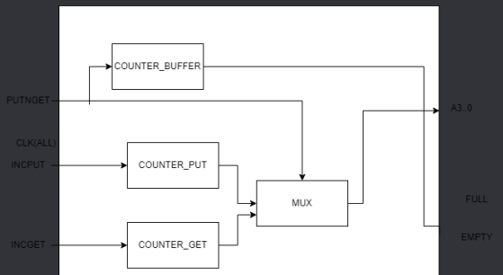
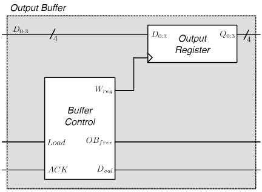
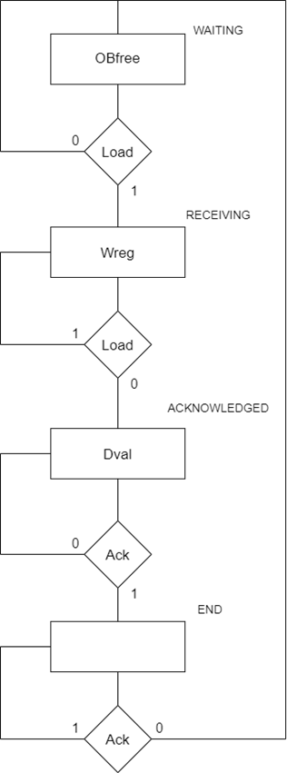

# ___Keyboard Reader___

* ___Key Decode___ $ \rightarrow $ descodificador de teclado
* ___Ring Buffer___ $ \rightarrow $ bloco de armazenamento
* ___Output Buffer___ $ \rightarrow $ bloco de entrega ao consumidor

 

---

## ___Key Decode___

* __Teclado 4x3__
* ___Key Scan___ $ \rightarrow $ varrimento do teclado
* ___Key Control___ $ \rightarrow $ controlo do varrimento e de fluxo

 

* __Detecção de teclas__ $ \rightarrow $ o sinal $ Kval $ é __ativado__ e disponibiliza-se o __código dessa tecla__ no barramento $ K_{0:3} $
 
* __Varrimento de teclas__: 
    * Ativação do sinal $ Kscan $, que __inicia o ciclo de varrimento__ do teclado
    * Apenas é iniciado um __novo ciclo de varrimento ao teclado__ quando o sinal $ Kack $ for __ativado__ e a __tecla premida for libertada__

---

### ___Key Scan (I)___

* __Teclado 4x3__
* __Contador__ $ \rightarrow $ gerador de códigos de teclas e controlo do ___decoder___ e do ___mux___
* ___Decoder___ $ \rightarrow $ controlo do varrimento (nível coluna)
* ___Mux___ $ \rightarrow $ controlo do varrimento (nível linha)

 

Vantagen de ter 2 __contadores__:
* Maior rapidez de varredura do teclado $ \rightarrow $ o __contador__ apenas tem de contar até 3, em vez de 12 $ \Rightarrow $ __menor probabilidade de perder teclas__

---

### ___Key Control___

 

* __STATE_DETETAR_TECLA__:
    * Informar que se iniciou um novo ciclo de varrimento 
    * Se não foi premida nenhuma tecla ativa-se o sinal $ Kscan $ de modo a que o contador se mantenha ativo de forma a permitir a constante deteção de teclas
* __STATE_TECLA_PREMIDA__:
    * Informar que foi premida uma tecla
    * Verificar se a tecla premida foi recebida
    * Verificar se a tecla premida foi libertada
* __STATE_ESPERAR_TECLA__:
    * Esperar que a tecla premida seja tratada

---

## ___Ring Buffer___

* ___Ring Buffer Control___ $ \rightarrow $ controlo do buffer
* ___Memory Address Control___ $ \rightarrow $ manipulação de endereços de memória
* ___RAM___ $ \rightarrow $ armazenamento de teclas

 

Estrutura de dados para armazenamento de teclas com disciplina FIFO e com capacidade de armazenar até 8 palavras (teclas) de 4 bits. 

* __Escrita de dados__: 
    * Ativação do sinal $ DAV $ (_Data Available_) pelo _Key Decode_, indicando que tem __dados para serem armazenados__
    * Logo que tenha disponibilidade para armazenar informação, o _Ring Buffer_ escreve os dados $ D_{0:3} $ em memória
    * Concluída a escrita em memória ativa o sinal $ DAC $ (_Data Accepted_) para informar o sistema produtor que os dados foram aceites
        * O Keyboard Reader mantém o sinal $ DAV $ ($ Kval $) ativo até que $ DAC $ seja ativado
        * O _Ring Buffer_ só desativa $ DAC $ depois de $ DAV $ ter sido desativado

* __Entrega de dados__ $ \rightarrow $ o bloco Ring Buffer procede à entrega de dados ao _Output Buffer_, sempre que esta indique que está disponível para receber, através do sinal _Clear To Send_ ($ CTS $)

---

### ___Ring Buffer Control___

 

* __STATE_WAITING__:
    * Verificar se o _Key Decode_ tem dados para serem armazenados
    * Verificar se o ___buffer___ __está cheio__ $ \rightarrow $ verificar se é possível realizar uma leitura de dados
    * Verificar se o ___buffer___ __está vazio__ $ \rightarrow $ verificar se é possível realizar uma leitura de dados
* __STATE_ACTIVATE_PUT__:
    * Informar o _MAC_ que se trata de uma operação de escrita
* __STATE_WRITE_KEY__:
    * Informar a _RAM_ para escrever os dados no endereço respetivo (fornecido pelo _MAC_)
* __STATE_INC_PUT__:
    * Atualizar o endereço de escrita do _MAC_
* __STATE_END_WRITE__:
    * Informar o _Key Decode_ que os dados foram aceites
    * Verificar se o _Key Decode_ já se apercebeu que os dados foram aceites
* __STATE_READ_KEY__:
    * Informar o _Output Buffer_ que os dados estão prontos para serem lidos
    * Verificar se o _Output Buffer_ já recebeu os dados
* __STATE_INC_GET__:
    * Atualizar o endereço de leitura do _MAC_

---

### ___Memory Address Control___

* ___3 Contadores___:
    * Contador do endereco de escrita
    * Contador do endereco de leitura
    * Ccontador de elementos no _buffer_
* ___Mux___ $ \rightarrow $ manipulação de endereços de memória

 

* Endereços:
    * Selecionados por $ put\overline{get} $
    * __Endereço de escrita__ $ \rightarrow $ putIndex
    * __Endereço de leitura__ $ \rightarrow $ getIndex
    * ___Full___ $ \rightarrow $ _buffer_ cheio
    * ___Empty___ $ \rightarrow $ _buffer_ vazio

---

## ___Output Buffer___

* ___Buffer Control___ $ \rightarrow $ controlo da interação com o _buffer_ e a entidade consumidora
* ___Shift Register___ $ \rightarrow $ gestão do código da tecla a ser enviada

 

* __Armazenamento de Dados__:
    * O _Output Buffer_ indica que está disponível para armazenar dados através do sinal $ OBfree $ $ \Rightarrow $ o _Ring Buffer_ pode ativar o sinal $ Load $ para registar os dados
 
* __Entrega de Dados__:
    * O _Control_ (entidade consumidora) quando pretende ler dados do _Output Buffer_, aguarda que o sinal $ Dval $ fique ativo, recolhe os dados e pulsa o sinal $ ACK $ indicando que estes já foram consumidos
    * O Output Buffer, logo que o sinal ACK pulse, deve invalidar os dados baixando o sinal $ Dval $ e sinalizar que está novamente disponível para entregar dados ao sistema consumidor, ativando o sinal $ OBfree $ 
    * O Output Buffer indica que já registou os dados desativando o sinal $ OBfree $
    
---

### ___Buffer Control___

 

 
* __STATE_WAITING__:
    * Informar o _Ring Buffer_ que está disponível para armazenar dados
    * Verificar se o _Ring Buffer_ quer armazenar dados
    * 
* __STATE_RECEIVING__:
    * Escrever os dados no _Shift Register_
    * Verificar se o _Ring Buffer_ já enviou os dados
* __STATE_ACKNOWLEDGED__:
    * Informar o _Control_ que os dados estão prontos para serem lidos
    * Verificar se o _Control_ recebeu os dados
* __STATE_END__:
    * Verificar se o _Control_ já leu os dados
