# __Codificação de Canal__

## __Modelo de Canal Discreto__

O canal é analisado através de modelo discreto usando __variáveis aleatórias__ (v.a.)

#

### __Modelo__ ___Binary Symmetric Channel___ - __BSC__

<div align=center> 

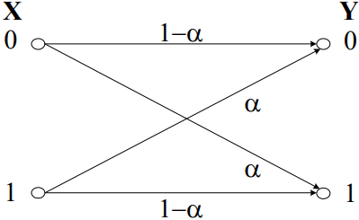

</div>

__Probabilidade de erro de bit__ $ \rightarrow P_e = P(Y_0, X_1) + P(Y_1, X_0) = P(Y_0|X_1).P(X_1) + P(Y_1|X_0).P(X_0) 
= \alpha.P(X_1) + \alpha.P(X_0) = \alpha $

$ P_e \rightarrow BER $

## __Códigos de controlo de erros__

A deteção e correção são obtidas pela introdução de __redundância__ na mensagem original.

#

### __Modos de funcionamento__

__FEC__ $ \rightarrow $ Forward Error Correction:
* Modo de correção de erros
* O recetor recebe as palavras, __deteta eventuais erros e corrige-os__

__ARQ__ $ \rightarrow $ Automatic Repeat Request:
* Modo de deteção de erros
* O recetor recebe as palavras e __deteta eventuais erros e em caso de erro, solicita a retransmissão__

#

## __Códigos de Bloco (n,k)__

Cada bloco de __k__ bits de mensagem origina uma palavra de código com __n__ bits:
* $ k  \rightarrow $ nº de bits de __mensagem__
* $ n  \rightarrow $ nº de bits de __palavra de código__

<div align=center> 

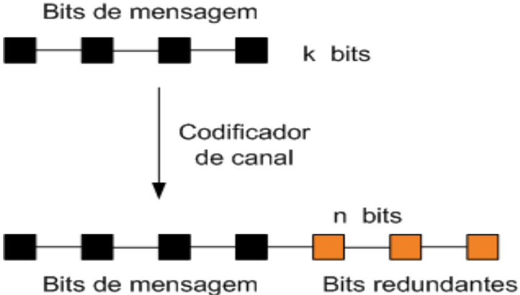 

</div>

#

### __Propriedades__

* ___Code rate___ $ \rightarrow R = \frac{k}{n} $, medida de eficiência;

* __Distância de Hamming__ ($ dH $):
    * Nº de dígitos em que __diferem 2__ quaisquer __palavras do código__

    * Eg.:
    
<div align=center> 

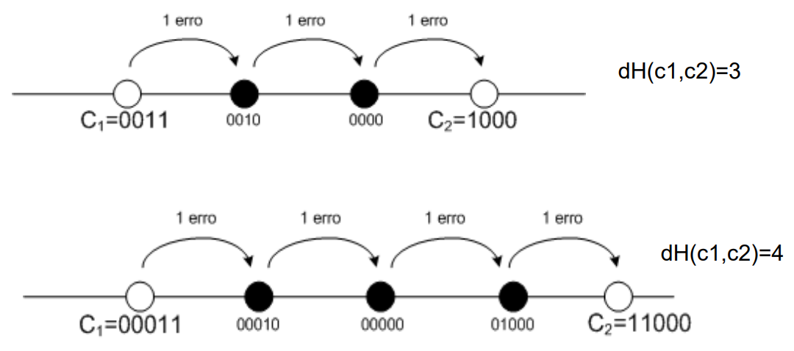 

</div>

* __Distância mínima__ ($ dmin $):
    * É a __menor__ $ dH $ entre __2__ quaisquer __palavras do código__

    * Majorante $ \rightarrow dmin \leq 1 + q, \ com \ q = n - k $

* __Deteta__ todos os padrões até __“I” erros__ $ \rightarrow l \leq dmin - 1 $

* __Corrige__ todos os padrões até __“t” erros__ $ \rightarrow t \leq \lfloor \frac{dmin - 1}{2} \rfloor $

* __Deteta “l” erros e corrige “t” erros__ $ \rightarrow dmin \geq l + t + 1, \ com \ l > t $

#

### __Códigos Lineares__

__Bloco__ $ \rightarrow $ todas as palavras têm a __mesma dimensão__;

__Linear__:
* O __vetor nulo__ pertence ao código;

* A __soma modular de quaisquer 2 palavras do código__ é ainda uma palavra do código.

__Palavras possíveis__ $ \rightarrow 2^n $ 

__Palavras de código__ $ \rightarrow 2^k $

__Nº de bits redundantes__ $ \rightarrow q = n – k $

__Mensagem__ $ \rightarrow m = [m_0 \ m_1 \ ... \ m_{k-1}] $

__Palavra de código__ $ \rightarrow c $

* __Sistemática__ $ \rightarrow c = [m_0 \ m_1 \ ... \ m_{k-1} \ b_0 \ b_1 \ ... \ b_{q-1}] $

* __Não Sistemática__ $ \rightarrow c = [m_0 \ b_1 \ b_0 \ m_1 \ ... \ m_{k-1} \ ... \ b_{q-1}] $

O desenho de __códigos eficientes__ é um __problema complexo__ $ \rightarrow \ \uparrow R \ \downarrow dmin $ ou $ \downarrow R \ \uparrow dmin $

Os códigos lineares são um __sub-conjunto__ de todos os códigos, requerem __menos memória__ e existem __codificadores e descodificadores simples__

#

### __Código de Repetição (3,1)__

Consiste na __repetição da mensagem__.

__Eg__.:

<div align=center> 

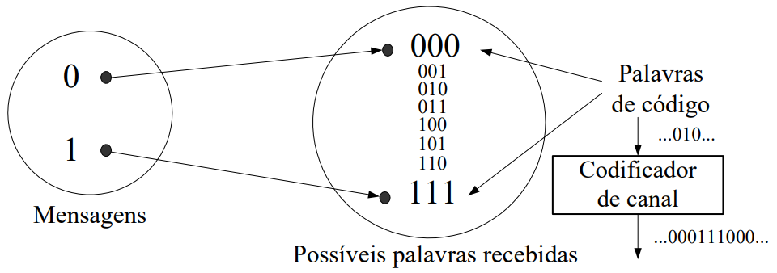 

</div>

```
m | c
0 | 000
1 | 111                    
```

* $ 2^k = 2^1 = 2 $ palavras

* $ 2^n = 2^3 = 8 $ possíveis palavras de código

Descodificação realizada por __maioria__.

<div align=center> 

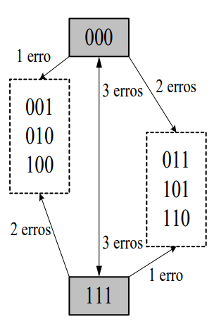

</div>

__Eg__.:

Com, por Exemplo $ \alpha = 10^{-15} $ 

$ P(1,3) = C^{3}_{1} \ . \ \alpha^1(1 - \alpha)^2 $ 

$ P(2,3) = C^{3}_{2} \ . \ \alpha^2(1 - \alpha)^2 $ 

#

### __Código Bit de Paridade (3,2)__

Adicionar __1 bit no final da mensagem__ -> este bit é a __soma módulo 2__ dos bits da mensagem.

__Palavra de código__ $ \rightarrow c = [m_0 \ m_1 \ m_0 \oplus m_1] $

__Eg__.:

```
m  | c
00 | 000
01 | 011     
10 | 101 
11 | 110              
```

<div align=center> 

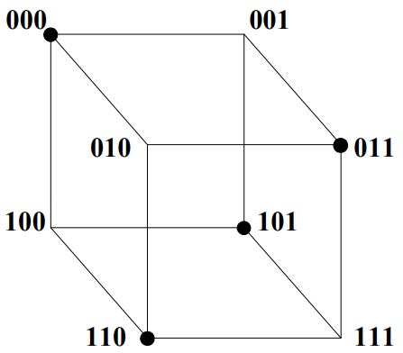 

</div>

#

### __Palavras de Código: Vetores__

<div style=flEg align=center> 

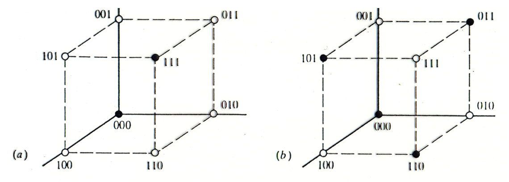

</div>


* (a) $ \rightarrow $ código de repetição (3,1) $ \Rightarrow $ 3 arestas entre as 2 palavras de código

* (b) $ \rightarrow $ código de bit de paridade (3,2) $ \Rightarrow $ 2 arestas entre 2 palavras de código mais próximas


#

### __Peso de Hamming (w)__

Nº de dígitos __não nulos__ numa palavra.

Sejam $ c_i \ e \ c_j $ duas palavras __distintas__ de um código linear de bloco:

$ dmin = min \ dH(c_i, c_j), $ com $ i \ne j $

Dado que o código é linear:

$ dmin = min \ w(c_i \oplus c_j) = min \ w(c_k), $ sendo $ c_k $ __palavra do código__, __diferente__ do vetor nulo

__Eg__.:

```
Código (3,1)                            Código (3,2)

m |  c  | w(c)     dmin = 3             m  | c   | w(c)     dmin = 2
0 | 000 | 0        l = 2                00 | 000 | 0        l = 1
1 | 111 | 3        t = 1                01 | 011 | 2        t = 0
                                        10 | 101 | 2
                                        11 | 110 | 2          
```

#

### __Códigos de Hamming__

$ (n, k) = (2^r - 1, 2^r -1 -r), \ com \ r \geq 2  $

__Eg.:__

* $ r = 3 \Rightarrow (7,4) $

* $ c = [m_0 \ m_1 \ m_2 \ m_3 \ b_0 \ b_1 \ b_2] $

* Equações de paridade:

    * $ b_0 = m_1 \oplus m_2 \oplus m_3 $

    * $ b_1 = m_0 \oplus m_1 \oplus m_3 $

    * $ b_2 = m_0 \oplus m_2 \oplus m_3 $

<div style=flEg align=center> 

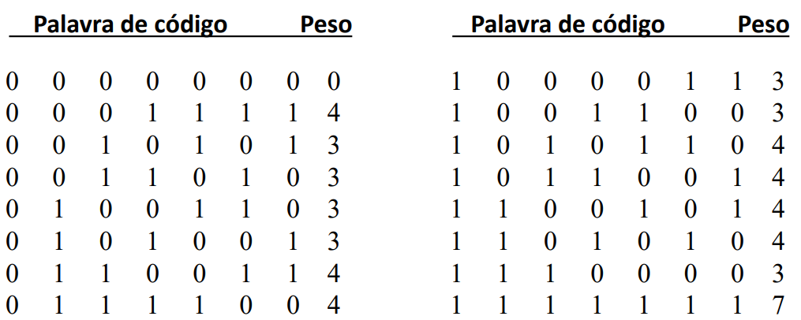

</div>

___Code Rate___ -> $ R_c = \frac{1 - q}{2^q -1} $

#

## __Códigos Cíclicos__

Uma __sub-classe__ dos códigos lineares de bloco.

__Qualquer rotação cíclica__ de qualquer ordem sobre uma __palavra de código__ é ainda uma __palavra de código__.

$ c(X) = m(X).g(X) $

* $ c(x) \rightarrow $ __palavra de código__ $ \rightarrow $ polinómio de grau $ n-1 $
* $ m(x) \rightarrow $ __mensagem__ $ \rightarrow $ polinómio de grau $ k-1 $
* $ g(x) \rightarrow $ __polinómio gerador__ de grau $ q $

$ c = [C_{n-1} \ C_{n-2} \ ... \ C_{1} \ C_{0}] $

__Nº de bits de paridade__ -> $ q $

### __Polinómio Gerador__

Se $ q $ é fator de $ X^n + 1 \ (resto [\frac{X^n + 1}{g(x)}] = 0) \Rightarrow g(x) $ é __gerador de um código__ $ (n, k), \ com \ q = n - k $

__Eg__.:

<div style=flEg align=center> 

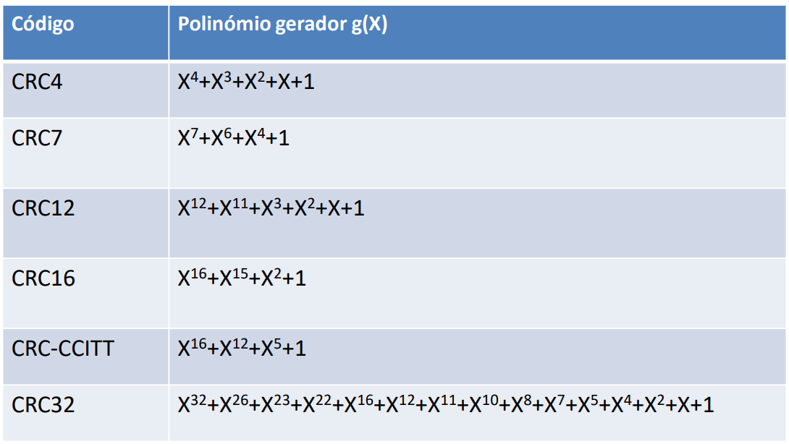

</div>

#

### __CRC - Cyclic Redundancy Check__

__Organização__ das palavras:

<div style=flEg align=center> 

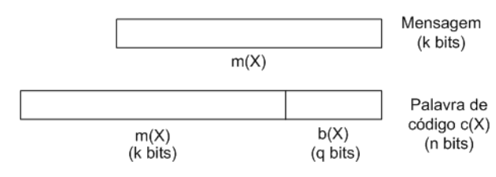

</div>

$ CRC = b(X) $ -> polinómio de grau $ q-1 $

$ c(X) = m(X).X^q + resto [\frac{m(X).X^q}{g(x)}] $

__Eg__.:

* Código (7,4)

* $ m(X) = X^3 + 1 = [100 \ 1] $

* $ g(X) = X^3 + X^2 + 1 = [110 \ 1] $

<div style=flEg align=center> 


</div>

#

## __Descodificador de Canal__

### __Características__

Descodificador:
* Recebe a __palavra__ $ y $ (pode ter erros)
* Estima a __palavra de código__ $ \widehat{x} $ que lhe deu origem
* Estima a __mensagem__ $ \widehat{m} $

Se $ y \notin x $ então __houve erro(s)__.

<div style=flEg align=center> 


</div>

#

### __Deteção - ARQ__

__Cálculo do Síndroma__ $ s \rightarrow $ __comparação bit a bit__ entre os __bits de paridade__ transmitidos e recalculados no descodificador

<div style=flEg align=center> 

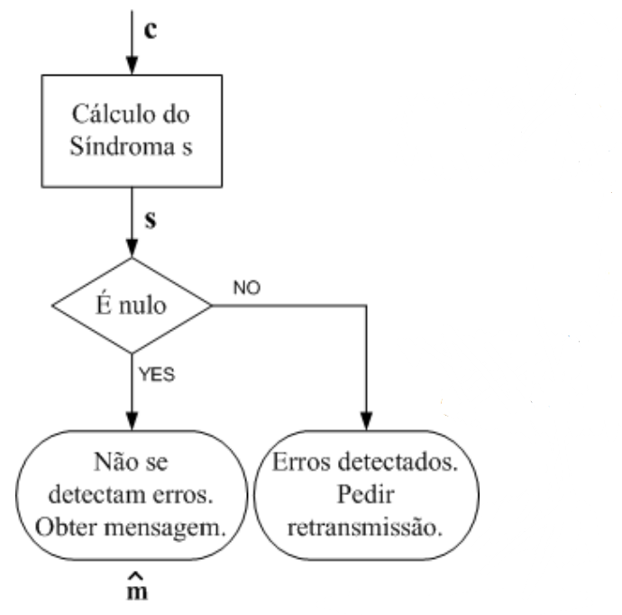

</div>

#

### __Correção - FEC__

<div style=flEg align=center> 

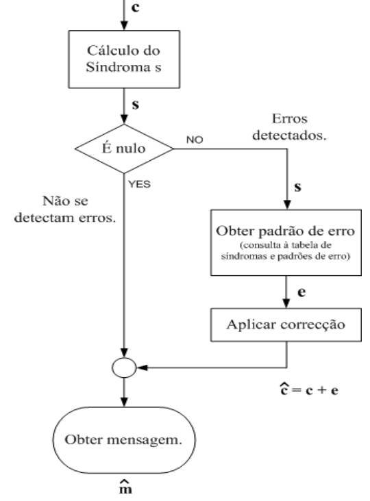

</div>

__Eg__.:

* Código Hamming (7,4)

<div style=flEg align=center> 

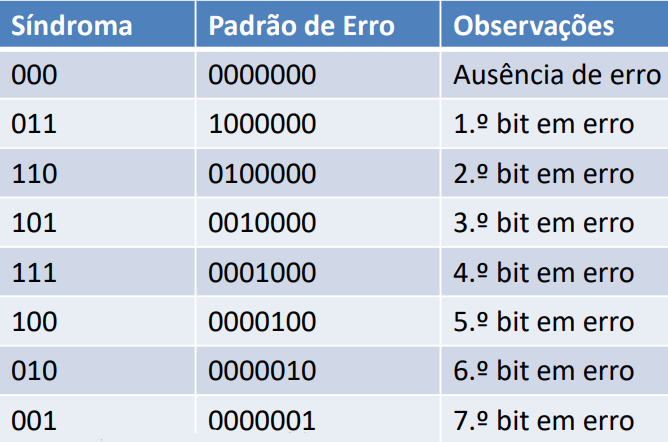

</div>

* Palavras de código:
    * $ c_1 = [1000 \ 011] $
    * $ c_2 = [0011 \ 010] $

* Palavras recebidas no descodificador:
    * $ y_1 = c_1 + [1000000] = [0 \ 000011] $
    * $ y_2 = c_2 + [0010000] = [00 \ 0 \ 1010] $
    * $ y_3 = c_1 + [1100000] = [01 \ 00011] $

* Síndromas obtidos:
    * $ s_1 = [011] $
    * $ s_2 = [101] $
    * $ s_3 = [101] $

* Padrões de erro associados:
    * $ e_1 = [1000000] $
    * $ e_2 = [0010000] $
    * $ e_3 = [0010000] $

* Palavras estimadas:
    * $ c_1 = y_1 + e_1 = [0001010] + [1000000] = [1000 \ 011]  $
    * $ c_2 = y_2 + e_2 = [0001010] + [0010000] = [0011 \ 010]  $
    * $ c_3 = y_3 + e_3 = [0100011] + [0010000] = [0110 \ 011]  $

* Mensagens obtidas após correção:
    * $ m_1 = [1000] $
    * $ m_2 = [0011] $
    * $ m_3 = [0110] \rightarrow $ __2 erros na palavra__ levaram a erro __após correção__

#

### __CRC__

Tipicamente utilizado em modo de __deteção__ de erros.

Tem __elevada capacidade de deteção de erros__, especialmente de __burst de erros__:
* Bloco contíguo de bits recebidos em erro; 
* O __1º e último bit__ distam __B bits entre si__, sendo B o __comprimento do burst__.

$ c(X) = m(X).g(X) $

$ y(X) = c(X) + e(X) $

* Se $ e(X) = 0 \rightarrow s(X) = 0 $ 
* Se $ e(X) \ne 0 \rightarrow s(X) = resto [\frac{e(X)}{g(x)}] $

#

## __Comparação de Códigos__

Quando $ dmin \geq 3 $ o código __também__ pode ser usado em modo __correção__.

<div style=flEg align=center> 

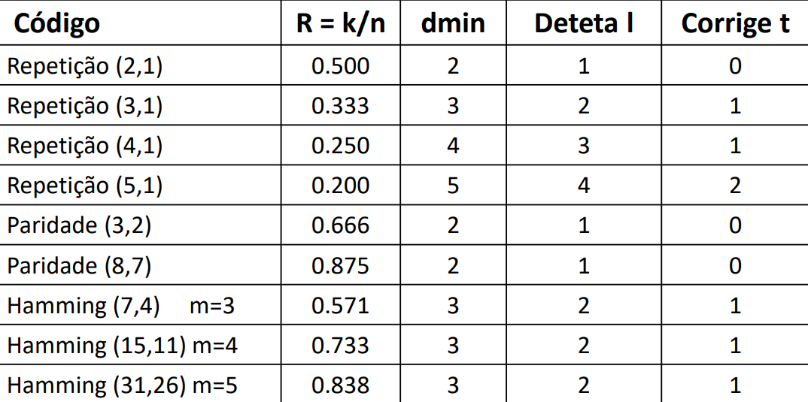

</div>

#

## __Análise Matricial dos códigos__

#

### __Matriz Geradora__

As __palavras de código__ são obtidas através do produto do vetor __mensagem__ pela __matriz geradora do código__ -> $ c = m \times G $

* $ dim(c) = 1 \times n $
* $ dim(m) = 1 \times k $
* $ dim(G) = k \times n $

Em códigos __sistemáticos__:
* $ G = [I_k | P] $ ou $ G = [P | I_k] $
* $ P \rightarrow $ matriz que estabelece as equações de paridade do código

__Eg__.:

* Código de repetição (3,1)

<div style=flEg align=center> 

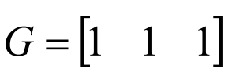

</div>

* Código de bit de paridade par (3,2)

<div style=flEg align=center> 


</div>

#

### __Códigos de Hamming - Forma Matricial__

$ c = m.[I_4 | P] $

<div style=flEg align=center> 


</div>

#

### __Codificação__

$ c = [m_0 \ m_1 \ ... \ m_{k-1} \ b_0 \ b_1 \ ... \ b_q-1] $

#

### __Descodificação__

__Matriz de controlo de paridade__ :
* Permite verificar se existem erros na palavra recebida, através do cálculo do síndroma
* $ H = [ P^T | I_{n-k}] $ ou $ [ \frac{P}{I_{n-k}}] $
* $ s = e.H^T = [s_0 \ s_1 \ ... \ s_{q-1}] $ 
    * Se $ s = 0 \Rightarrow $ __não__ se __detetam erros__
    * Se $ s \ne 0 \Rightarrow $ existem __erros detetados__ 

__Eg__.:

* Código de Hamming (7,4)

<div style=flEg align=center> 

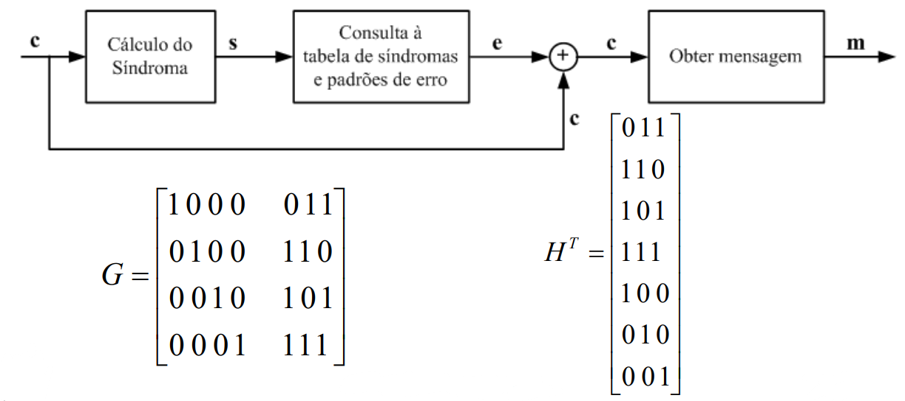

</div>
