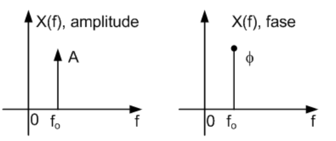
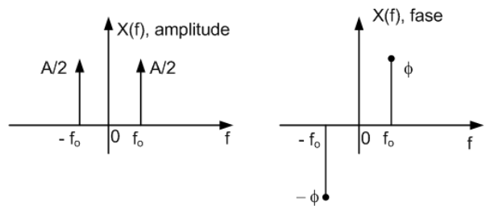
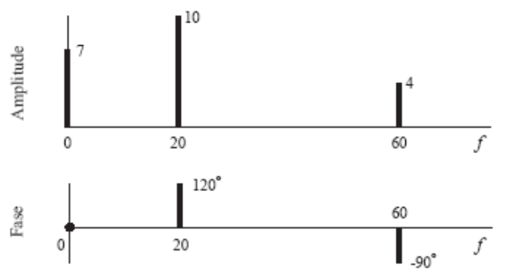
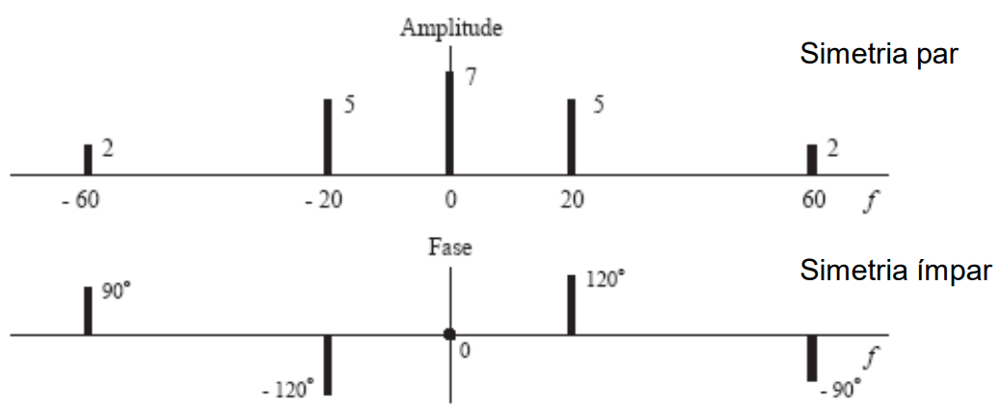
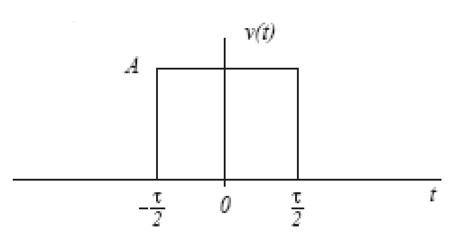
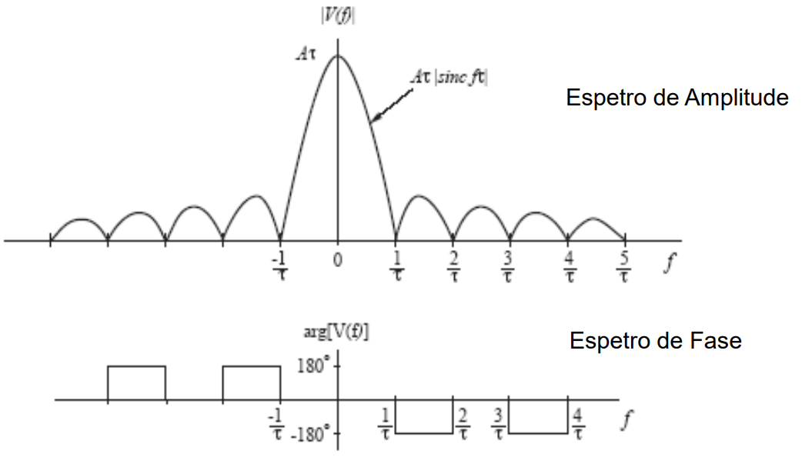
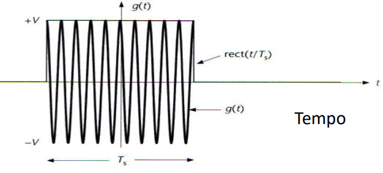
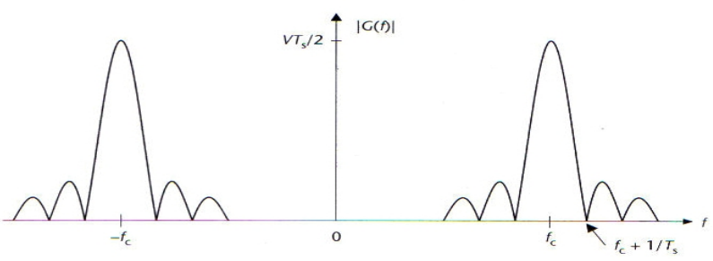
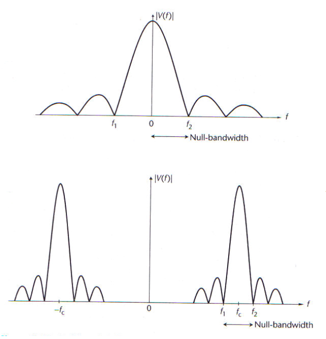
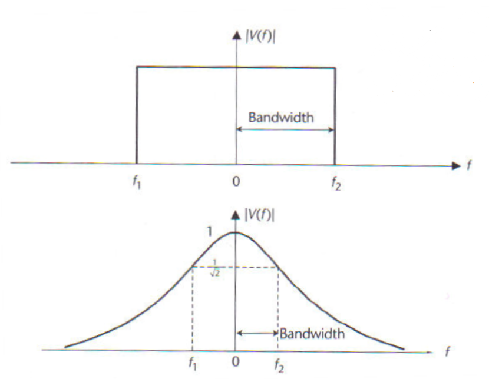

# __Sinais - Espetro__

## __Sinusóide__

$ v(t) = A.cos(2.\pi.f_0.t + \phi) $

 

#

## __Espetro de Amplitude e de Fase__

Domínio do Tempo $ \rightarrow x(t) = \frac{A}{2}.cos(2.\pi.f_0.t + \phi) + \frac{A}{2}.cos(2.\pi.(-f_0).t - \phi) $

__Espetro de amplitude__ $ \rightarrow $ indica a __distribuição de potência__ pelas frequências

__Espetro de fase__ $ \rightarrow $ indica o __desfasamento de cada componente__ de frequência (desvio para t=0)

1 __linha no espetro unilateral__ $ \rightarrow $ 1 __sinusóide__

2 __linhas no espetro bilateral__ $ \rightarrow $ 1 __sinusóide__

__E.g__:

$ v(t) = 20.cos(2.\pi.1000.t + \frac{\pi}{3}) $

 

#

### __Espetro Unilateral__

 

#

### __Espetro Bilateral__

 

#

## __Adição de Sinusóides__

 

 

$ v(t) = (7 + 10).cos(2.\pi.20.t + \frac{2.\pi}{3}) + 4.cos(2.\pi.60.t - \frac{\pi}{2}) $

__Espetro Bilateral__:

 

#

## __Cálculos de Indicadores__

__Espetro Unilateral__ $ \rightarrow P_x = A_0^2 + \sum^{+\infty}_{k=1} \frac{A_k^2}{2} $

__Espetro Bilateral__ $ \rightarrow P_x = \sum^{+\infty}_{k=-\infty}|c_k|^2 $

__Valor médio__ $ (DC) \rightarrow A_0 $

__Largura de Banda__ $ (LB) \rightarrow $ largura da faixa de frequências ocupadas pelo sinal

__Eg__:

$ LB = 60 \ Hz $

 

#

## __Transformada de Fourier__

__Equação de síntese__ $ \rightarrow x(t) = \int_{-\infty}^{+\infty}X(f).e^{(j.2.\pi.f.t)} \ df $

#

## __Pulso Retangular__

 

$ E = A^2.t $

#

### __Espetro de Amplitude e de Fase__

 

__Expressão no domínio do tempo__ $ \rightarrow v(t) = A.\Pi(\frac{t}{\tau}) $

__Expressão do espetro__ $ \rightarrow V(f) = A.\tau.sinc(f.\tau) $

$ sinc = \frac{sin(x)}{x} $ ou $ \frac{sin(\pi.x)}{\pi.x} $

#

## __Pulso Sinusoidal__

 

$ E = \frac{V^2}{2}.T_s $

$ LB = \frac{2}{T_S} = 2R_s $

### __Espetro de Amplitude__

 

__Expressão no domínio do tempo__ $ \rightarrow g(t) = V.\Pi(\frac{t}{T_s}).cos(2.\pi.f_c.t) $

__Expressão do espetro__ $ \rightarrow G(f) = V.\frac{T_s}{2}.sinc((f - f_c).T_s) + V.\frac{T_s}{2}.sinc((f + f_c).T_s) $

#

## __Cálculo de Indicadores__

$ E = \int_{-\infty}^{+\infty}|V(f)|^2 \ df $

$ Gv(f) = |V(f)^2| $

#

### __Largura de Banda__

Definida a partir dos __zeros espetrais__.

 

#

### __Ocupação do Esspetro__

Sinais do tipo __passa-baixo__ $ \rightarrow $ apenas ocupam as __frequências baixas__

 

