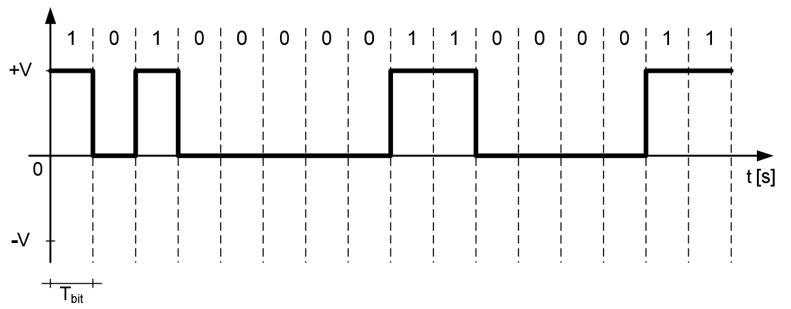
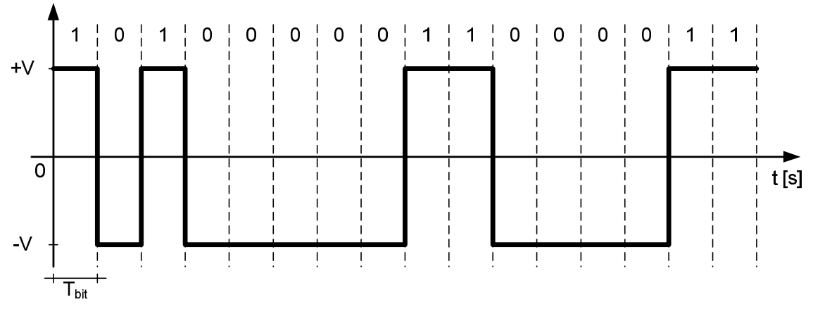
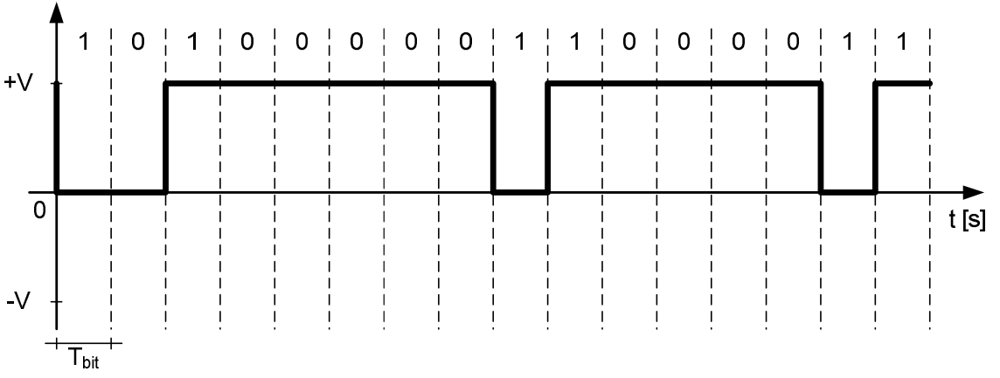
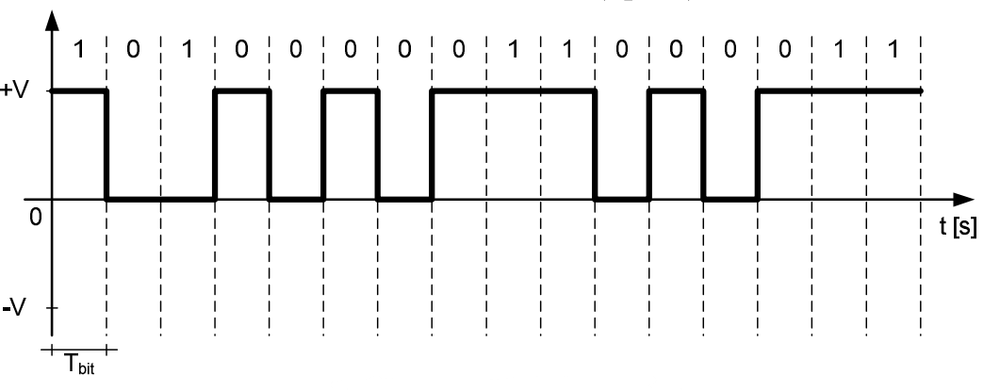
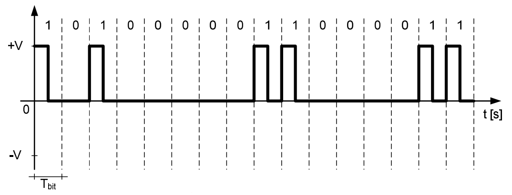
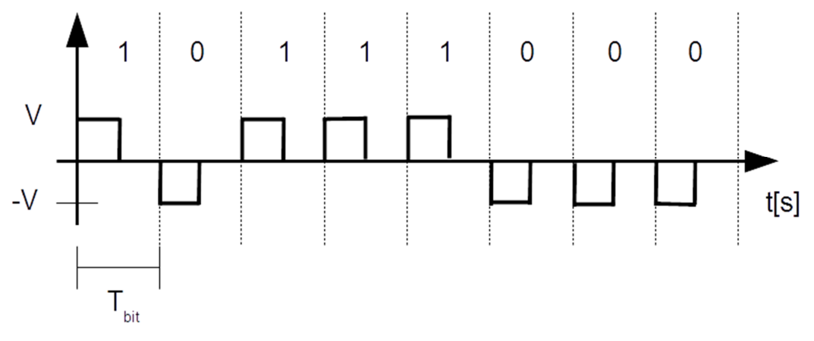
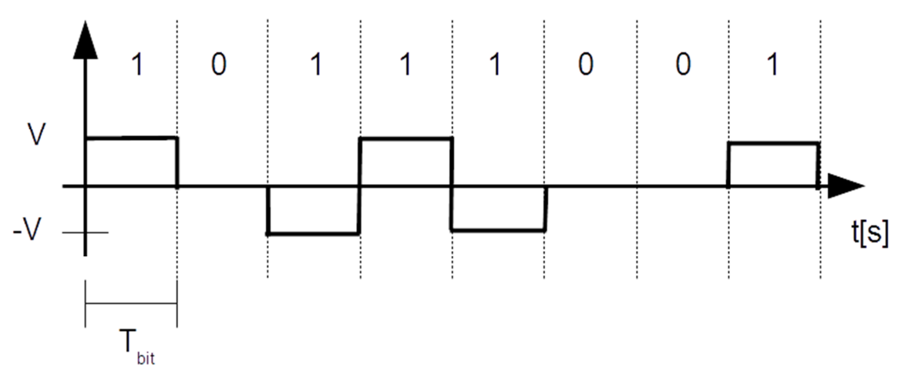
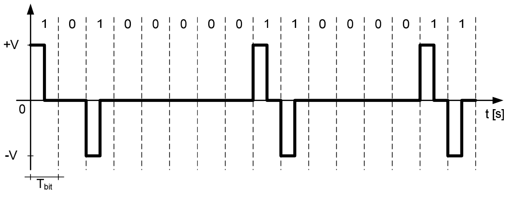
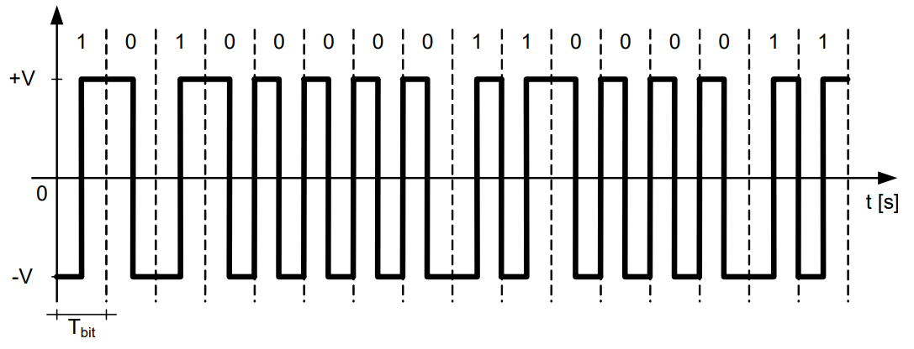

# __Transmissão em Banda Base - Códigos de Linha__

__Banda base__ $ \rightarrow $ o meio de transmissão admite componentes de frequência em torno de 0 $ Hz $.

Utilizada em __curta distância__.

#

## __Códigos de Linha__

__Pulsos elétricos__ para codificar os bits 1 e 0.

#

### __Características__
Necessidade de __transições__ (para evitar __perda de sincronismo__)

Sinal de relógio __embebido no código__.

Vulnerabilidade a __fatores externos__:
* __Ruído__
* __Interferências__ e interferência inter-simbólica

#

### __NRZ - Unipolar__

__Não retorna a zero__ dentro do $ T_{bit} $.

 

__Energia média por bit__ $ \rightarrow E_b = \frac{V^2}{2}.T_{bit} $

__Valor médio__ ($DC$) $ \rightarrow $ __diretamente proporcional__ do nº de __bits 1__ na mensagem

#

### __NRZ - Bipolar ou NRZ - Polar__

 

__Energia média por bit__ $ \rightarrow E_b = V^2.T_{bit} $

__Valor médio__ ($DC$) $ \rightarrow $ __é nula__ quando temos __igual nº de bits 1 e 0__ na mensagem

__Melhor desempenho__ que NRZ Unipolar

#

### __NRZ - Absoluto (Unipolar e Bipolar)__

Transmissão a curta distância com 100% de eficiência.

Sinal de relógio __em separado__

Problemas:
* __Perda de sincronismo__ para __longas sequências__ do mesmo bit
* Inversão dos níveis (__troca dos fios__) resulta na __descodificação errada__ de todos os bits

#

### __NRZ - Diferencial__

Os bits são codificados com __alternância de nível no início do__ $ T_{bit} $ (transições) para __minimizar perdas de sincronismo__.

__Unipolar ou bipolar__

#

### __NRZ - Mark__

Início do $ T_{bit} \rightarrow $ __bit 1__

Se __bit = 0__ $ \Rightarrow $ __Mantém o nível__

 

__Energia média por bit__ $ \rightarrow E_b = V^2.T_{bit} $ ou $ E_b = \frac{V^2}{2}.T_{bit} $

#

### __NRZ - Space__

Início do $ T_{bit} \rightarrow $ __bit 0__

Se __bit = 1__ $ \Rightarrow $ __Mantém o nível__

 

__Energia média por bit__ $ \rightarrow E_b = V^2.T_{bit} $ ou $ E_b = \frac{V^2}{2}.T_{bit} $

#

### __NRZ - Absoluto e NRZ - Diferencial__

Perdas de bits devido à perda de sincronismo em longas sequências:
* __Mesmo bit__ $ \rightarrow $ NRZ Unipolar e NRZ Bipolar
* __0s__  $ \rightarrow $ NRZ-M
* __1s__ $ \rightarrow $ NRZ-S

Para __não perder sincronismo__:
* __Linha paralela__ (extra) de __clock__
* Códigos Return to Zero (RZ)
* Códigos __bifásicos__

#

### __RZ__

Muda de nível __a meio do__ $ T_{bit} \Rightarrow $ __mais transições__ que NRZ $ \Rightarrow $ __aumento da largura de banda__

Tem __menor energia média por bit__ do que o NRZ

* Unipolar

 

__Energia média por bit__ $ \rightarrow E_b = \frac{V^2}{4}.T_{bit} $

* Bipolar

 

__Energia média por bit__ $ \rightarrow E_b = \frac{V^2}{2}.T_{bit} $

#

### __AMI__
Técnica que pode ser aplicada sobre códigos NRZ ou RZ.

Gera sinais que __tendem para valor médio nulo__.

* NRZ

 

__Energia média por bit__ $ \rightarrow E_b = \frac{V^2}{2}.T_{bit} $

* RZ

 

__Energia média por bit__ $ \rightarrow E_b = \frac{V^2}{4}.T_{bit} $

#

### __Manchester__
Gera sempre sinais com __valor médio nulo__.

__Largura de banda igual__ a RZ.

Tem sempre uma transição __a meio do__ $ T_{bit} $ (__código bifásico__)

 

__Energia média por bit__ $ \rightarrow E_b = V^2.T_{bit} $
