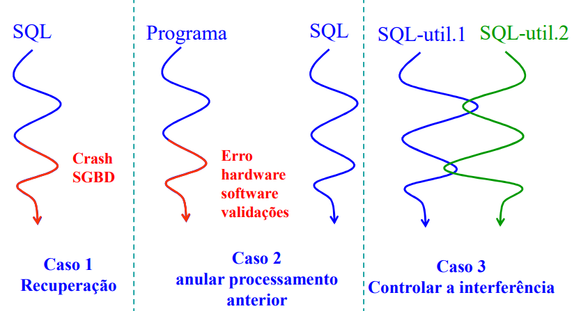
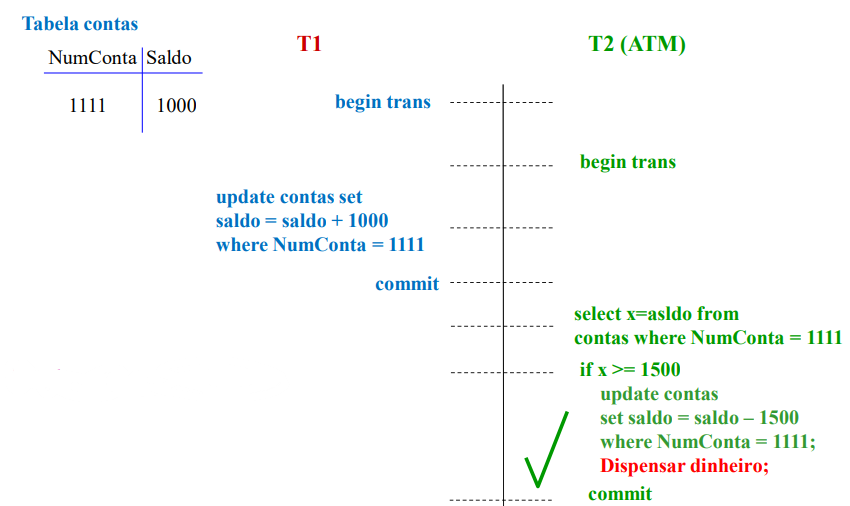

# __Processamento Transacional__

## __Transações__

### __O Porquê de Transações?__

 

---

### __Tipos de ações__

* Não protegidas
* Protegidas
* Reais

__Ação atómica__ $ \rightarrow $ quando __executada num determinado nível de
abstração mais elevado__, ou __é executada completamente com sucesso__, (produzindo todos os seus efeitos), ou, então, __não produz quaisquer efeitos__ diretos ou laterais.

---

### __Propriedades ACID__

* Atomicidade
* Consistência
* Isolamento
* Durabilidade.

---

### __Escalonamentos__

Um escalonamento de um __conjunto de transações__ $ (T_1, ... ,T_n) $ é
uma __ordenação__ $ S $ das __operações__ em cada um dos $ T_i $,  tal que __todas as ações__ de cada $ T_i $ aparecem em $ S $ pela __mesma ordem em que ocorrem__ em $ T_i $.

__E.g.__:

 

__2 operações__ num escalonamento $ S $ __conflituam__ se verificarem, simultaneamente, as seguintes condições:
* As operações __pertencem__ a $ T_i $ __diferentes__
* Ambas as operações __acedem__ ao __mesmo item de dados__
* Pelo menos __1__ das operações é __w(x)__

---

### __Tipos de Escalonamentos__

___Cascadeless___ $ \rightarrow $ __nenhuma__ das suas transações __lê um item__ escrito por __outra transação__ ainda __não terminada__ $ \Rightarrow $ não contém ___dirty reads___

__E.g.__:

 

 

---

__Recuperável__ $ \rightarrow $ __não existe__ nenhuma __transação__ que faça __commit__ tendo __lido um item depois__ de ele ter sido __escrito por outra transação__ ainda __não terminada com commit__. 

`NÃO ser RECUPERÁVEL` $ \Rightarrow $ `NÃO ser CASCADELESS` 

__E.g.__:

 

 

