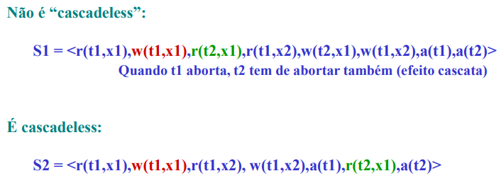
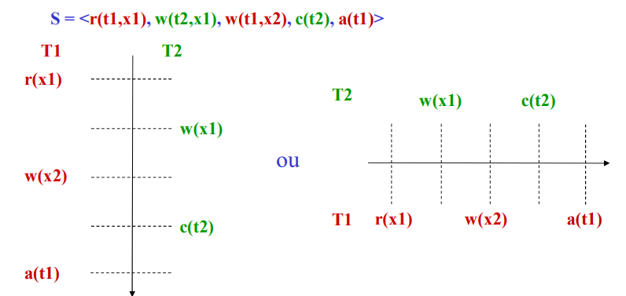
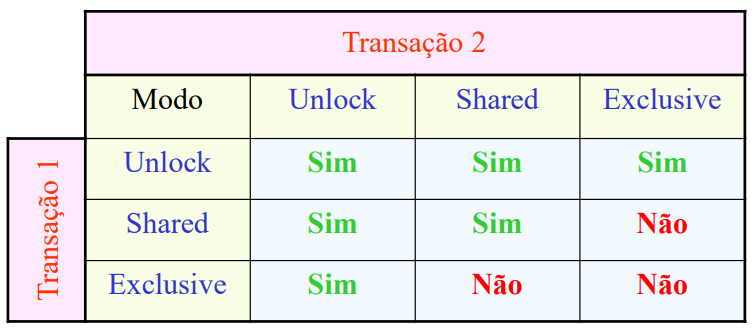

# __Processamento Transacional__

## __Transações__

### __O Porquê de Transações?__

 

---

### __Tipos de ações__

* Não protegidas
* Protegidas
* Reais

__Ação atómica__ $ \rightarrow $ __executada num determinado nível de
abstração mais elevado__, ou __é executada completamente com sucesso__, (produzindo todos os seus efeitos), ou, então, __não produz quaisquer efeitos__ diretos ou laterais.

---

### __Propriedades ACID__

* Atomicidade
* Consistência
* Isolamento
* Durabilidade.

---

## __Escalonamentos__

Um escalonamento de um __conjunto de transações__ $ (T_1, ... ,T_n) $ é
uma __ordenação__ $ S $ das __operações__ em cada um dos $ T_i $,  tal que __todas as ações__ de cada $ T_i $ aparecem em $ S $ pela __mesma ordem em que ocorrem__ em $ T_i $.

__E.g.__:

 

__2 operações__ num escalonamento $ S $ __conflituam__ se verificarem, simultaneamente, as seguintes condições:
* As operações __pertencem__ a $ T_i $ __diferentes__
* Ambas as operações __acedem__ ao __mesmo item de dados__
* Pelo menos __1__ das operações é __w(x)__

---

## __Tipos de Escalonamentos__

### ___Cascadeless___ 
__Nenhuma__ das suas transações __lê um item__ escrito por __outra transação__ ainda __não terminada__ $ \Rightarrow $ não contém ___dirty reads___.

__E.g.__:

 

 

---

### __Recuperável__ 
__Não existe__ nenhuma __transação__ que faça __commit__ tendo __lido um item depois__ de ele ter sido __escrito por outra transação__ ainda __não terminada com commit__.

`NÃO ser RECUPERÁVEL` $ \Rightarrow $ `NÃO ser CASCADELESS` 

__E.g.__:

 

---

### __Estrito__ 
__Nenhuma__ das suas __transações__ __lê nem escreve__ um __item escrito__ por __outra transação__ ainda __não terminada com commit__ $ \Rightarrow $ não contém ___dirty reads___ nem ___dirty writes___.

__E.g.__:

 

---

### __Série__ 
Para __toda a transação__ $ T $ as __operações__ de $ T $ são __executadas consecutivamente__, sem interposição de operações de outras transações $ \Rightarrow $ __limita__ a __concorrência__.

`N transações` $ \Rightarrow $ `N! escalonamentos série possíveis` 

__E.g.__:

 

---

### __Equivalentes__ 
A __ordem__ de quaisquer __2 operações conflituantes__ é a __mesma__ nos __2 escalonamentos__.

__E.g.__:

 

---

### __Serializável__
É __equivalente__ do __ponto de vista de conflito__ a __1 dos escalonamentos série__ possíveis com as transações de $ S $.

__E.g.__:

 

---

### __Grafo de Precedências__

Desenhar __1 vértice__ por cada __transação do escalonamento__.

Por cada __par conflituante__ $ a1(T_i,x), a2(T_j,x) $ tal que $ a1 $ __precede__ $ a2 $ desenhar 1 __arco__ de $ T_i $ para $ T_j $.

`Existem CICLOS` $ \Rightarrow $ `NÃO é SERIALIZÁVEL`

__E.g.__:

 

---

### __Linhas de Tempo__
As __ações__ são colocadas nos __tempos__ correspondente às __posições__ que __ocupam no escalonamento__.

__E.g.__:

 

---

## __Anomalias__

Nome | Tipo | Descrição
| :---: | :---: | :---: |
___Dirty Write___ | W/W | Escalonamentos não __estritos__, ainda que ___cascadeless___
___Dirty Read___ | W/R | Escalonamentos __não__ ___cascadeless___
___Nonrepeatable Read___ | R/W | Escalonamento ___cascadeless___ e __recuperável__ mas __não serializável__
___Phanton Read___ | R/W | -

---

## __Estados__

 

---

## __Níveis de Isolamento__

 

---

## __Protocolo__ ___Two Phase Lock___ __(2PL)__

 

* __write(x)__ $ \rightarrow $ lock ___Shared___

* __read(x)__ $ \rightarrow $ lock ___Exclusive___

### __Tipos de Ação__

* __Bem Formada__: protegida por um __par lock/unlock__ $ \Rightarrow $ __Transação bem formada__
* __2 Fases__: __não__ executa __unlock__ antes de __locks__ de outras ações da __mesma transação__ $ \Rightarrow $ __Transação de duas fases__

Nível de Isolamento | Leitura | Escrita
| :---: | :---: | :---: |
___Read Uncommitted___ | __NÃO é__ Bem Formada | Bem Formada e de 2 Fases
___Read Committed___ | Bem Formada | Bem Formada e de 2 Fases
___Repeatable Read___ | Bem Formada e de 2 Fases | Bem Formada e de 2 Fases
___Serializable___ | Bem Formada e de 2 Fases | Bem Formada e de 2 Fases

---

### ___Deadlocks___

 

Formas de lidar com ___deadlocks___:
* __Pessimista__ $ \rightarrow $ __não__ se permite o __início__ de 1 __transação__ até que se __garanta__ que ela consegue __adquirir__ todos os __locks__ de que __necessita__
* __Otimista__ $ \rightarrow $ permitir que as __transações__ se __iniciem sem restrições__, mas, __quando existir 1__ ___deadlock___ __abortar__ 1 ou mais das __transações envolvidas__ no ___deadlock___

---

### ___Starvation___

1 __transação__ ficar __indefinidamente__ à __espera__ de um __item__.

Formas de lidar com ___starvation___:
* Adotar uma disciplina __FIFO__ no __acesso__ aos __itens__

---

## ___PostgreSQL___

Todas as __escritas__ são de __2 fazes__ e colocam 1 __lock__. 

___Exclusive Locks___:
* ___FOR UPDATE___:
    * _SELECT FOR UPDATE_     
    * _DELETE_
    * UPDATE $ \rightarrow $ __colunas__ que pertençam a uma __restrição__ ___primary key___ ou ___unique___ que possam ser usadas numa __chave estrangeira__
* ___FOR NO KEY UPDATE___:
    * _SELECT FOR UPDATE_
    * _UPDATE_ $ \rightarrow $ __colunas__ que não usem ___lock FOR UPDATE___

___Shared Locks___:

* ___FOR SHARE___:
    * _SELECT FOR SHARE_
* ___FOR KEY SHARE___:
    * _SELECT FOR KEY SHARE_

---

## __Graus de Isolamento__

Nível de Isoçamento | Grau |
| :---: | :---: |
___Chaos___ | 0 |
___Read Uncommitted___ | 1 |
___Read Committed___ | 2 |
___Repeatable Read/Serializable___ | 3 |

---

## __Controlo de Concorrência com Protocolo__ ___Snapshot___

### __First Commiter Wins__

* As __escritas__ são feitas numa __cópia local__ da __transação__.
* Existindo várias __transações__ a pretender realizar __commit__, a __1ª__ delas que verificar que o __timestamp__ da __versão atual__ é < ao seu __timestamp__ escreve a __nova versão__ $ \Rightarrow $ todas as outras irão abortar.

### __First Updater Wins__

* As __escritas__ são realizadas com ___exclusive lock___
* Existindo várias __transações__ a pretender realizar __commit__, a __1ª__ delas que verificar que o __timestamp__ da __versão atual__ é < ao seu __timestamp__ escreve a __nova versão__ $ \Rightarrow $ todas as outras irão abortar.

---

## __Níveis de Isolamento no PostgreSQL__

* Usa-se sempre o __protocolo snapshot__ como base $ \Rightarrow $ __nunca__ existem __dirty reads__ $ \Rightarrow $ __não existe__ o nível de isolamento ___read uncommitted___.
* ___Read committed___ $ \rightarrow $ Cada __instrução__ vê os __dados estáveis__ imediatamente __antes__ da sua __execução__.
* ___Repeatable read___ $ \rightarrow $ Vêm-se as __versões estáveis__ no momento do __início da 1ª instrução__ que __não__ seja de __controlo transacional__ dentro da transação.