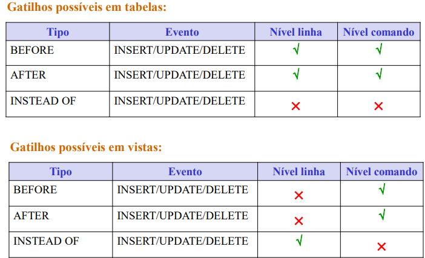

# __Programação__ ___SQL___

## __Tipos de Data__

* SERIAL
* INTEGER
* DECIMAL(CASAS_TOTAIS, CASAS_DECIMAIS)
* VARCHAR(TAMANHO)
* TEXT
* DATE
* TIME

---

## __Tabelas__

E.g.:
```sql
CREATE TABLE IF NOT EXISTS TABELA1 (
  prop1         INTEGER NOT NULL,
  prop2         DECIMAL(5,2) UNIQUE NOT NULL,
  prop_foreign  TEXT NOT NULL,
  prop_date     DATE CHECK (prop_date > '2000-01-01'),
  PRIMARY KEY(prop1),
  FOREIGN KEY(prop_foreign) REFERENCES TABLE2(prop)
);

DROP TABLE IF EXISTS TABELA1 CASCADE;
```

---

## __Declaração de Variáveis__

```sql
DECLARE
    name TIPO := valor (opcional);
```

__E.g.__:
```sql
DECLARE
    var1 INTEGER := 1;
    var2 DATE;
```

Também é possível guardar valores de um ___SELECT___ numa variável.

__E.g.__:
```sql
DECLARE
    var1 DECIMAL(5,2);

SELECT prop2 INTO var1 FROM TABELA1 WHERE prop1 = 1;
```

---

## __Instruções de Controle de Fluxo__

### ___IF___

```sql
IF expressão booleana THEN
    ...
ELSIF expressão booleana THEN
    ...
ELSE (opcional)
    ...
END IF;
```

__E.g.__:
```sql
DECLARE
    var1 INTEGER := 1;

IF var1 IS NULL THEN
		RAISE NOTICE 'var1 é null';
ELSEIF var1 = 1 THEN
        RAISE NOTICE 'var1 é 1';
ELSE
        RAISE NOTICE 'var1 não é null nem 1';
END IF;
```

---

### ___CASE___

```sql
CASE variável
    WHEN expressão THEN
        ...
    WHEN expressão THEN
        ...
    ELSE
        ...
END CASE
```

__E.g.__:
```sql
DECLARE
    var1 INTEGER := 1;

CASE var1
    WHEN NULL THEN
        RAISE NOTICE 'var1 é null';
    WHEN 1,2 THEN
        RAISE NOTICE 'var1 é 1 ou 2';
    ELSE
        RAISE NOTICE 'var1 não é null nem 1 nem 2';
END CASE
```

---

## __Ciclos__

* `` EXIT WHEN expressão booleana (opcional) ``
* `` CONTINUE WHEN expressão booleana (opcional) ``

### ___WHILE___

```sql
WHILE expressão booleana LOOP
    ...
END LOOP
```

__E.g.__:
```sql
DECLARE
    var1 INTEGER := 1;

WHILE var1 < 10 LOOP
    RAISE NOTICE 'var1 = %', var1;
    var1 = var1 + 1;
END LOOP;
```

---

### ___FOR___

```sql
FOR target IN query LOOP
    ...
END LOOP
```

__E.g.__:
```sql
DECLARE var1 RECORD;

FOR var1 IN SELECT * FROM TABELA1 LOOP
    IF var.prop1 > 0 THEN
        CONTINUE;
    END IF;
    EXIT WHEN var.prop1 = 0;
END LOOP;
```

---

## __Exceções__

```sql
RAISE NOTICE/EXCEPTION 'mensagem';
RAISE NOTICE/EXCEPTION 'mensagem = %', variável;
```

__E.g.__:
```sql
DECLARE var1 INTEGER := 1;

RAISE NOTICE 'var1';
RAISE EXCEPTION 'var1 = %', var1;
```

---

## __Procedimento__

* ``OUT param`` $ \rightarrow $ __retornar valores__.
* ``param TIPO DEFAULT valor`` $ \rightarrow $ __valor__ ___default___.

```sql
CREATE OR REPLACE PROCEDURE nome(OUT param1 TIPO, param2 TIPO)
LANGUAGE plpgsql AS $$
DECLARE
	...
BEGIN
	...
END;
$$;

DROP PROCEDURE nome(TIPO, TIPO);

CALL nome(valor1, valor2);
```

__E.g.__:
```sql
CREATE OR REPLACE PROCEDURE mudarProp2(p1 INTEGER, p2 DECIMAL(5,2))
LANGUAGE plpgsql AS $$
DECLARE
	var1 INTEGER;
BEGIN
	SELECT prop1 INTO var1 FROM TABELA1 WHERE prop1 = p1;

	IF var1 IS NULL THEN
		RAISE EXCEPTION 'Não existe';
	END IF;

	UPDATE TABELA1 SET prop2 = p2 WHERE prop1 = p1;
END;
$$;
```	

---

### __Níveis de Isolamento__

É feito um "__encapsulamento__" do __procedimento__ que __contém__ a __lógica__ dentro do __procedimento__ que irá __definir__ o __nível de isolamento__ (por default é ___READ COMMITED___).

```sql
CREATE OR REPLACE PROCEDURE procedimento(param1 TIPO, param2 TIPO)
LANGUAGE plpgsql AS
$$
BEGIN
    COMMIT; 
	SET TRANSACTION ISOLATION LEVEL nível de isolamento;
	call procedimentoLógica(param1, param2);			
END;
$$;
```

__E.g.__:
```sql
CREATE OR REPLACE PROCEDURE mudarProp2(p1 INTEGER, p2 DECIMAL(5,2))
LANGUAGE plpgsql AS
$$
BEGIN
    COMMIT; 
	SET TRANSACTION ISOLATION LEVEL REPETABLE READ;
	call mudarProp2Lógica(p1, p2);			
END;
$$;
```

---

## __Funções__

```sql	
CREATE OR REPLACE FUNCTION nome(param1 TIPO, param2 TIPO)
RETURNS TIPO -- Pode ser VOID
LANGUAGE plpgsql AS $$
DECLARE
	...
BEGIN
	...
END;
$$;

DROP FUNCTION nome(TIPO, TIPO);

SELECT * FROM nome(valor1, valor2);
```

__E.g.__:
```sql
CREATE OR REPLACE FUNCTION prop2(p1 INTEGER)
RETURNS INTEGER
LANGUAGE plpgsql AS $$
DECLARE
	var2 INTEGER;
BEGIN
	SELECT prop2 INTO var2 FROM TABELA1 WHERE prop1 = p1;

	IF var2 IS NULL THEN
		RAISE EXCEPTION 'Não existe';
	END IF;

   	RETURN var2;
END;
$$;
```

---

## __Vistas__

```sql	
CREATE OR REPLACE VIEW nome AS 
	query;
	
DROP VIEW IF EXISTS nome;

SELECT * FROM nome;
```

__E.g.__:
```sql
CREATE OR REPLACE VIEW tabela1Vista AS 
	SELECT prop1, prop2, prop_date, 
	prop2Máximo() AS valorMáximo
	FROM TABELA1
	WHERE prop2 != 0;
	
DROP VIEW IF EXISTS tabela1Vista;

SELECT * FROM tabela1Vista;
```

---

## ___Triggers___

* __Evento__:
    * _INSERT_
    * _UPDATE_
    * _DELETE_
* __Tempo de Ação__:
    * _BEFORE_
    * _AFTER_
    * _INSTEAD OF_ $ \rightarrow $ apenas para __vistas__
* __Ação__:
    * _FOR EACH { ROW | STATEMENT }_ ...

```sql
CREATE OR REPLACE TRIGGER nome
	tempo da ação evento ON nomeTabela
		ação;

DROP TRIGGER IF EXISTS nome ON jogadorTotalInfo;
```

<div align=center> 



</div>

__E.g.__:
```sql
CREATE OR REPLACE TRIGGER colocarPropZeroTrigger
	INSTEAD OF DELETE ON tabela1Vista
	FOR EACH ROW
		EXECUTE FUNCTION colocarPropZero(); 

------------------------------------------------

CREATE OR REPLACE FUNCTION colocarPropZero()
RETURNS TRIGGER
LANGUAGE plpgsql AS $$
DECLARE
	var1 INTEGER;
BEGIN
	SELECT prop1 INTO var1 FROM table1Vista;
	CALL mudarProp2(var1, 0);
	RETURN NEW;
END;
$$;        
```

