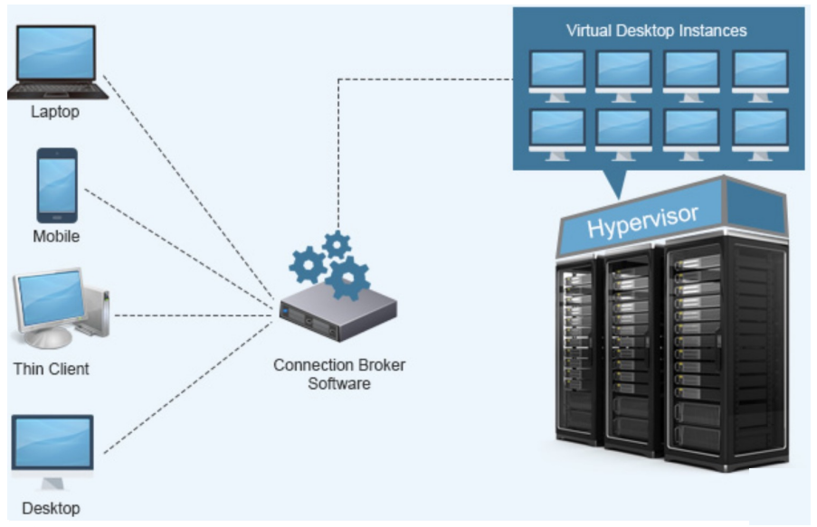

# ___Google Cloud Platform___

## __Armazenamento__

* __Disco__:
    * __Discos persistentes de bloco e SSD__ associados a instâncias de VM,
    * __Discos de rede__ -> _Filestore_ (_Network Attached Storage_).

* ___Cloud Storage___ -> armazenamento de __objetos binários__ (BLOBS).

* __Bases de dados não relacionais__ (_NoSQL_):
    * ___Firestore___;
    * ___Datastore___.

* __Bases de dados relacionais__:
    * ___SQL___;
    * ___Spanner___.

* __Bases de dados em memória__:
    * ___Memorystore___;
    * ___Redis___.

#

## __Serviço__ ___Pub/Sub___

Mantém estado sobre um conjunto de tópicos e de subscrições associada a cada tópico.

* ___Subscriber___ -> Recebe mensagens de uma subscrição.
* ___Publisher___ -> Envia mensagens para um tópico.

#

## __Computação__

* __Máquinas Virtuais__ (_Computer Engine_):
    * Diferentes dimensões (número de CPUs, memória, etc);
    * Regulares -> _start_/_stop_ controlado pelo utilizador;
    * Preemptivas -> _start_/_stop_ controlado pela _Google_;
    * Grupos de instâncias para escalabilidade horizontal e balanceamento de carga.

* ___Serverless computing___ -> _Cloud Functions_.

* __Contenedores__:
    * ___Kubernetes engine___;
    * ___Cloud Run___.

* ___App Engine___ -> Plataforma gerida para execução de aplicações web com suporte a várias frameworks.

#

## ___Event-driven serverless computing___

Execução de código em resposta a eventos.

* __Computação tradicional__ -> O servidor está ativo e a consumir recursos mesmo na ausência de pedidos.

* __Computação _serverless___ -> O servidor está ativo e a consumir recursos apenas durante o processamento do evento.

#

## __Processamento de Dados (_Big Data_)__

* __Inteligência Artificial__:
    * _Vision_;
    * _Translation_.

* __Análise de Dados__:
    * _BigTable_;
    * _BigQuery_;
    * _Dataproc_;
    * _Genomics_.

#

## __Contas e Projetos__

* Qualquer utilizador com uma conta Google pode aceder aos serviços GCP.
* Um utilizador de serviços GCP pode ter N projetos.
* Um utilizador pode gerir N contas de facturação.
* 1 projeto consome recursos monetários de 1 conta de facturação.
* 1 conta de facturação pode ser associada a N projetos.

#

## __Tipos de Virtualização__