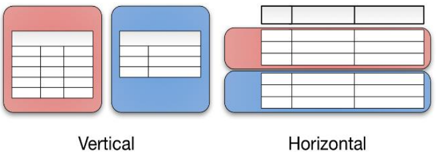
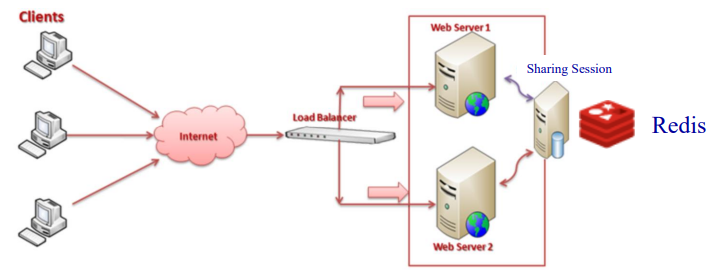

# __Armazenamento em Bases de dados NoSQL__

## __Modelo Relacional__

* __Persistência de dados__ -> Capacidade de __persistir grandes quantidades de dados__ incomportáveis de manter em memória;

* __Concorrência__ -> Permitir que __múltiplos utilizadores acedam e alterem os dados sem confiltos__;

* __Transações__ -> Permitir que uma __sequência de ações__, incluindo alterações de dados, sejam __executadas atomicamente__;

* __Integração__ -> Permitir que __aplicações em diferentes tecnologias__ possam partilhar (__aceder e alterar__) dados num __único repositório__;

* ___Standards___ -> Com a __álgebra relacional e a linguagem standard SQL__ é possível usar BDs relacionais em __múltiplos cenários aplicacionais__;

* __Impedance Mismatch__ -> __Limitações de representação__ no modelo relacional (_Relation, Tuple, Attributes_) de modelos de informação em memória onde podemos ter __representações agregadas, de dados, mais complexas e menos estruturadas face ao modelo relacional__.

    * Os ___frameworks___ _Object-relational mapping_ (ORM) resolvem parte do problema mas introduzem __perdas de desempenho__ e podem introduzir __falhas de consistência__ (má utilização: cache de dados nos objetos).

## ___Clusters___ __de Computadores__

O aparecimento de _clusters_ de computadores possibilita a __escalabilidade horizontal__ (_scale-out_).

Num cenário (_scale-up_) as maiores exigências de processamento e armazenamento de dados implicam __computadores de custo elevado__ existindo um __limite de crescimento__.

A alternativa é usar (_scale-out_) com uma __grande quantidade de pequenos computadores__ ligados em _cluster_, permitindo também __maior resiliência a falhas__.

• O __modelo relacional não é apropriado__ para trabalhar em clusters.

### __Vantagens__

* __Escalabilidade elevada__ -> Milhares de máquinas;

* __Custos reduzidos__ -> O custo de 10 máquinas de menor capacidade é inferior a uma máquina com capacidade idêntica;

* __Flexibilidade__ -> Os dados não têm de ser estruturados segundo um _schema_ como no modelo relacional, permitindo __formas flexíveis__ de agregar os dados (_key-value, document, column, graph_);

* __Disponibilidade__ -> __Replicação intensiva__ garantindo menores _bottlenecks_ e suporte para __tolerância a falhas__.

## __Distribuição de Dados__

### ___Sharding___

__Fragmentação de dados em múltiplos servidores__ de um _cluster_, em que __cada servidor contém um subconjunto dos dados__. 

<div align="center">



</div>

### ___Replication___

__Cópias dos dados existem em múltiplos servidores__, permitindo múltiplos acessos aos mesmos dados em diferentes servidores.

* ___Master-slave___: Um nó ____master_ gere as escritas___, enquanto os nós ___slave_ só suportam leituras__ sincronizando-se com o _master_;

* ___Peer-to-peer___: __Escritas em qualquer nó__, necessitando de __coordenação para evitar conflitos__ na atualização das várias réplicas.

A replicação ___Master-slave_ reduz os conflitos de atualização dos dados__ mas,
por outro lado, a replicação ___peer-to-peer_ evita a sobrecarga de escritas num
único ponto de falha__.

## __Bases de Dados NoSQL__

* __Não__ usam o __modelo relacional__;

* Executam-se e suportam armazenamento de dados em _clusters_ de __múltiplos computadores__;

* __Múltiplas soluções__ _open-source_;

* ___Schemaless___ -> __Não existe um _schema_ rígido__ como no modelo relacional;

* __Flexibiliza__ a __persistência de dados__ (utilização híbrida de bases de dados consoante os requisitos da aplicação).

### ___BASE___

* __BA__ (___Basically Available___) -> __Podem existir falhas parciais__ nalgumas partes do sistema distribuído, __continuando o resto do sistema a funcionar__, principalmente na presença de réplicas;

* __S__ (___Soft state___): __Os dados podem estar desatualizados__ (expirados), sendo necessário __atualizá-los com processamento posterior__;

* __E__ (___Eventually consistent___) -> Os __dados podem estar inconsistentes durante alguns intervalos de tempo__.

## ___Tipos de Bases de Dados NoSQL___

__Todos partilham__ a noção que __existe uma key__ usada para obter (_lookup_) um agregado de dados.

### ___Key-value___

O agregado é opaco, permitindo unicamente obter o __total do agregado através de uma key__.

<div align="center">



</div>

### ___Document___

Permite __queries baseadas na estrutura interna__ do agregado (documento)

### ___Graph___

Organizam os dados em grafos (nós e arcos) permitindo __associações complexas entre entidades__.

<div align="center">


</div>

### ___Collumn - Family___

Permite estruturar o agregado em __famílias de colunas__ permitindo à base de dados usar __estratégias de _sharding___ das diferentes famílias de colunas.

<div align="center">


</div>

## __Modelos de dados do__ ___Firestore___

* Uma base de dados é um __conjunto de coleções__;

* __Coleções contêm documentos__, os quais __têm identificadores únicos__ (_Document ID_) e representam agregados de campos (_fields_) de vários tipos:
    * inteiros, booleanos, _arrays_, pontos geográficos, maps, _reference_ para outros documentos;

* __Documentos da mesma coleção__ podem ter __número e tipo de campos diferentes__;

* __Um documento__ pode conter __novas coleções__ com até um __máximo de 100 níveis de profundidade__;

* __Documentos devem ser pequenos__ com máximo 1 MiB (mebibyte = 1024*1024 bytes).

## __API Java__

### __Autenticação no Acesso ao Serviço__

```java
/* Variável de ambiente com chave
* GOOGLE_APPLICATION_CREDENTIALS=<pathname do ficheiro json com chave>
*/

GoogleCredentials credentials = GoogleCredentials.getApplicationDefault();

// ou

InputStream serviceAccount = new FileInputStream(KEY_JSON);
GoogleCredentials credentials = GoogleCredentials.fromStream(serviceAccount);

FirestoreOptions options = FirestoreOptions
    .newBuilder()
    .setDatabaseId("db-name")
    .setCredentials(credentials)
    .build();
Firestore db = options.getService();
```

### __Exemplos__

````java
/*
* Inserir/Atualizar com map
*/

CollectionReference colRef = db.collection("Users");
DocumentReference docRef = colRef.document("Bill-Gates");

HashMap<String, Object> map = new HashMap<String, Object>();
map.put("first", "Bill");
map.put("last", "Grates"); // Grates ? Teremos de atualizar depois
map.put("born", 1955);

ApiFuture<WriteResult> result = docRef.create(map); // Create new document
result.get();

// ou

ApiFuture<WriteResult> result = docRef.set(map); // Overwrites a document
result.get(); // criado se não existir documento

// update 1 or more fields
map.put("last", "Gates");
result = docRef.update(map); // gera erro se documento não existir
result.get();

// update a specific field
result = docRef.update("last", "Gates"); 
result.get();

/*
* Inserir documentos a partir de objetos
*/

import com.google.cloud.firestore.GeoPoint;

public class OcupacaoTemporaria {
    public int ID;
    public Localizacao location;
    public Evento event;
}

public class Localizacao {
    public GeoPoint point;
    public Coordenadas coord;
    public String freguesia;
    public String local;
}
public class Coordenadas {
    public Double X;
    public Double Y;
}

public class Evento {
    public int evtID;
    public String nome;
    public String tipo;
    public Date dtInicio;
    public Date dtFinal;
    public Licenciamento licenciamento;
    public Map<String, String> details;
}
public class Licenciamento {
    public String code;
    public Date dtLicenc;
}

CollectionReference colRef = db.collection("ocupa-espacos");
OcupacaoTemporaria ocup = new OcupacaoTemporaria();

ocup.ID = 1111;

ocup.location = new Localizacao();
ocup.location.point = new GeoPoint(-9.143645, 38.753404);
ocup.location.freguesia = "Alvalade";
ocup.location.local = "Praça de Alvalade";

ocup.event = new Evento(); ocup.event.evtID = 1017;
ocup.event.nome = "Programa do Indie Junior";
ocup.event.tipo = "Publicitário";

DocumentReference docRef = colRef.document("DocID-" + ocup.ID);

// asynchronously overwrite data using Futures
ApiFuture<WriteResult> result = docRef.set(ocup);
System.out.println("Update time:" + result.get().getUpdateTime());

/*
* Listagem de documentos de uma coleção
*/

CollectionReference cref = db.collection("ocupa-espacos");
Iterable<DocumentReference> allDocs = cref.listDocuments();

for (DocumentReference docref : allDocs) {
    ApiFuture<DocumentSnapshot> docfut = docref.get();
    DocumentSnapshot doc = docfut.get();

    // Time at which this document was last updated
    Timestamp updateTime = doc.getUpdateTime();
    System.out.println(updateTime + “:doc: “ + doc.getData());
}

/*
* Ler campo ou objeto a partir de um documento
*/

String ID="DocID-1111";
DocumentReference docRef = db.collection("ocupa-espacos").document(ID);
ApiFuture<DocumentSnapshot> future = docRef.get();
DocumentSnapshot document = future.get();

// ler campo do documento
GeoPoint coord = document.getGeoPoint("location.point");
System.out.println(coord.toString());

// ler objeto: obtém campos do documento para campos com o mesmo nome na classe
OcupacaoTemporaria ocup = document.toObject(OcupacaoTemporaria.class);
System.out.println(ocup.location.point.toString());

/*
* Apagar campos e documentos
*/

DocumentReference docRef = db.document("ocupa-espacos/DocID-1111");

// apagar campo
Map<String, Object> updates = new HashMap<>();
updates.put("location.coord", FieldValue.delete());
ApiFuture<WriteResult> writeResult = docRef.update(updates);
System.out.println("Update time : " + writeResult.get());

// apagar documento
ApiFuture<WriteResult> resFuture = docRef.delete();
WriteResult res = resFuture.get();

/*
* Query simples
*/

// Single query
Query query = db.collection("ocupa-espacos").whereGreaterThan("ID", 2030);

// retrieve query results asynchronously using query.get()
ApiFuture<QuerySnapshot> querySnapshot = query.get();

for (DocumentSnapshot doc: querySnapshot.get().getDocuments()) {
    System.out.print("DocID: " + doc.getId());
    System.out.println(" Freguesia: " + doc.get("location.freguesia"));
}

/*
* Interrogações simples de campos complexos
*/

FieldPath fp = FieldPath.of("location", "freguesia");
Query query = db.collection("ocupa-espacos").whereEqualTo(fp, "Alvalade");
ApiFuture<QuerySnapshot> querySnapshot = query.get();

for (DocumentSnapshot doc: querySnapshot.get().getDocuments()) {
    System.out.print("DocID: " + doc.getId() + " @ "+ doc.get("location"));
}

fp = FieldPath.of("location","coord");
HashMap<String,Double> cor = new HashMap<String, Double>() {
    { put("X",-9.143645364765742); put("Y",38.75340432875235); }
};

query = db.collection("ocupa-espacos").whereEqualTo(fp, cor);
querySnapshot = query.get();

for (DocumentSnapshot doc: querySnapshot.get().getDocuments()) {
    System.out.print("DocID: " + doc.getId() + " @ "+ doc.get("location"));
}

/*
* Interrogações compostas com índice composto
*/

// Composed query
FieldPath fpath = FieldPath.of("location","freguesia");

Query query = db.collection("ocupa-espacos")
    .whereEqualTo(fpath, "Misericórdia")
    .whereLessThan("ID", 2100);

ApiFuture<QuerySnapshot> querySnapshot = query.get();
for (DocumentSnapshot doc: querySnapshot.get().getDocuments()) {
    System.out.println(doc.getId()+":Doc:"+doc.getData());
}
````

### __Limitações em__ ___Queries___ __no__ ___Firestore___

* Numa query __não é possível usar os operadores de desigualdade__ (e.g. o operador _whereGreaterThan_) __em campos diferentes__;

O resumo das limitações das interrogações no Firestore pode ser visto [aqui](https://firebase.google.com/docs/firestore/query-data/queries#query_limitations).